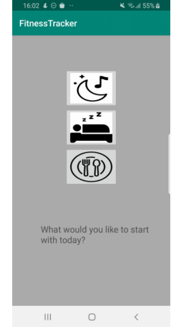
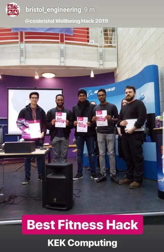
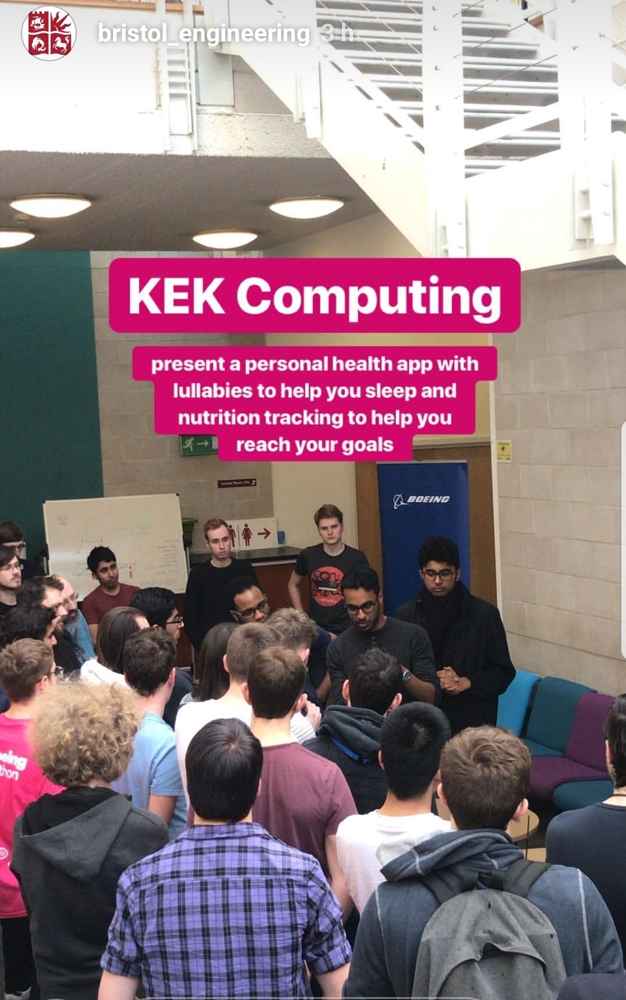

## University of Bristol and Boeing Wellbeing Hackathon 2019 Fitness Category Winner - Sleep and Nutrition Tracker

### About
* This is an Android application that tracks sleep time, nutrition tracking and provides an lullaby interface to improve sleep in order to keep track of the personal health of a user in real time.
* This was our team's submission for the Fitness category in the Wellbeing Hackathon.
* We were tasked with tackling one of three major issues with a tech-based solution which included: Fitness,Safety and Mental Health.
* We were inspired to produce a solution for Fitness since we were already working on our start up idea [Enerjog](https://enerjog-tracker.herokuapp.com/) at the time.
* We thought about tackling both fronts of Fitness and Mental Health by producing an application that could serve as an event scheduling mobile application to improve organization as well as provide the necessary features to track health-related improvement.
* This application managed to win the ***Best Fitness Hack*** award at this event.

### Pre-requisites
* Android powered smartphone or Android emulator.

### How to Run
* You could find the [APK](app/release) for this application called ```apk-release.apk```.
* You could install the APK on your phone by following this [guide](https://www.lifewire.com/install-apk-on-android-4177185).

### Application Screenshots


### Gallery




